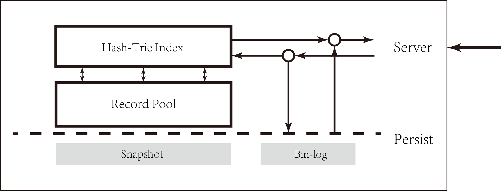
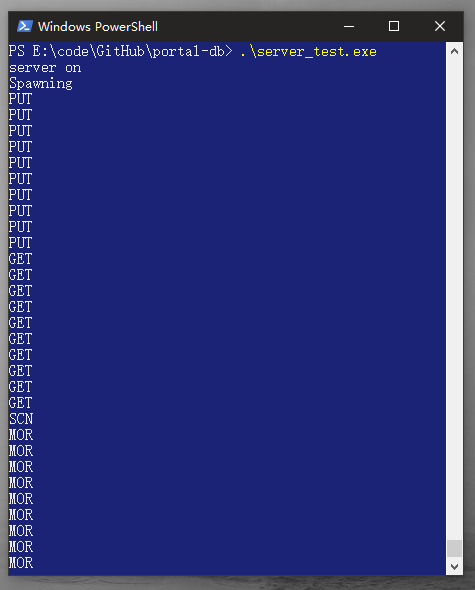
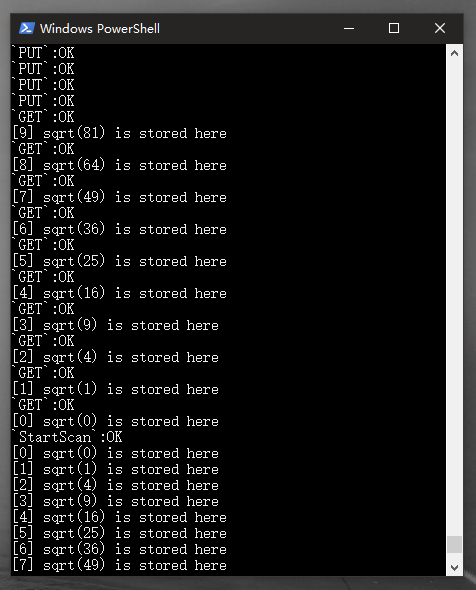

# portal-db

persistent and scalable in-memory key-value engine. **PingCAP** internship homework.

## Todo

- Server
	-	[x] socket + threads
	-	[ ] socket + multiplexing
  -	[x] chunk recovery from break
- Query Dispatcher
  - [ ] range dispatch and sharding
- Storage Engine
  - [x] HashTrie
  - [x] `SCAN` operation and iterator
  -	[x] rwlock thread safety
  - [ ] tested lock-free thread safety
- Durability
  - [x] snapshot and recovery
  - [x] bin-log and recovery
  - [ ] faster thread safety
  - [x] persist benchmark

## Feature

- **in-memory**: guarantee fast update and query unless key-value data exceeds memory capacity
- **persistent**: provide different level of persistency (best-effort, transaction-level)
- **consistent**: consistent `GET` / `PUT` and optional snapshot semantics for `SCAN` operation
- **scalable**: support range sharding

## Tech Overview



**portal-db** provides `GET`, `PUT`, `DELETE`, `SCAN` operations on in-memory data set. This specific workload demands a space-efficient, high-performance storage structure.

In this respect, portal-db proposes **HashTrie** as a hybrid data structure that leverages hashtable's query performance and trie's data ordering. HashTrie can dynamically transform between two different structures w.r.t. data amount without serious data race.

Also, to provide transaction-level persistency for in-memory data, portal-db applies Snapshot + BinLog approach. Deamon thread periodically flush global snapshot onto disk, while binary log will be appended to `.bin` everytime an update is granted.

It's worth noticing that portal-db also sacrifices `very-fast-scan`, `fast-recovery` in pursuit of those features. In another word, portal-db is purely an attempt to reach satisfiable tradeoff for this specific workload.

## Benchmark

- Setup

```
CPU         :   Core i5-6200U @ 2.30GHz
Memory      :   2 GB
Keys        :   8 bytes
Values      :   256 bytes
Entries     :   100'0000
```

- In-Memory HashTrie

```
single thread:
write       :   2.09354 seconds, 120.26 MB/s
read        :   1.37388 seconds, 183.25 MB/s
scan-sort   :   1.65211 seconds, 152.38 MB/s
scan-unsort :   1.33734 seconds, 188.26 MB/s
```

- Persistent HashTrie

```
single thread with two daemon threads:
write       :   26.2163 seconds, 9.61 MB/s
read        :   1.8911 seconds, 133.13 MB/s
scan-sort   :   1.9776 seconds, 127.31 MB/s
scan-unsort :   1.3179 seconds, 191.04 MB/s
delete      :   25.5188 seconds, 9.86 MB/s
resource usage:
memory      :   344 MB
snapshot    :   251 MB
bin-log     :   0 ~ 2.7 MB
```

- Recovery

```
snapshot    :   2.3713 seconds, 106.17 MB/s
bin-log     :   0.136 seconds
```

## Server

<p align="center">
    
    <p align="center">
        <em>server</em>
    </p>
</p>

<p align="center">
    
    <p align="center">
        <em>client</em>
    </p>
</p>
